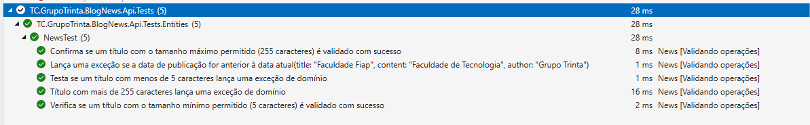

# Diagram


## Architecture


## Techical Stack

- ASP.NET Core 6.0 (with .NET 7.0)
- ASP.NET WebApi Core
- ASP.NET Identity Core
- Entity Framework Core
- .NET Core Native DI
- MediatR
- Swagger UI
- SQL Azure
- xUnit
- Moq
- Fluent Assertions
- Fixture

## Design Patterns

- Domain Driven Design
- CQRS
- Unit Of Work
- Repository & Generic Repository
- Inversion of Control / Dependency injection
- ORM
- Mediator
- Specification Pattern
- Options Pattern


## How to run


- For Visual Studio: `Select profile > Run (F5)`
- For VSCode: `Select configuration > Run (F5)`
- For Terminal:
```PowerShell

dotnet build src\TC.GrupoTrinta.BlogNews.Api\TC.GrupoTrinta.BlogNews.Api.csproj
dotnet run --project src\TC.GrupoTrinta.BlogNews.Api\TC.GrupoTrinta.BlogNews.Api.csproj --launch-profile http
dotnet watch --project src\TC.GrupoTrinta.BlogNews.Api\TC.GrupoTrinta.BlogNews.Api.csproj run
```

### Testing

Unit tests are designed to validate small pieces of code, which can involve domain validations, method validations, or, more broadly, class validations.

- Run the tests: `dotnet test`



The tests were conceived using the xUnit Test framework, created by James Newkirk, who was also responsible for the development of NUnit v2. Additionally, in conjunction with Fake, a specialized library for providing mock data, we will use it to share data between the test methods and classes in the test project.

The tests cover the following scenarios:

1. Confirma se um título com o tamanho máximo permitido (255 caracteres) é validado com sucesso
2. Lança uma exceção se a data de publicação for anterior à data atual
3. Testa se um título com menos de 5 caracteres lança uma exceção de domínio
4. Título com mais de 255 caracteres lança uma exceção de domínio
5. Verifica se um título com o tamanho mínimo permitido (5 caracteres) é validado com sucesso

#### Packages

* [xUnit](https://xunit.net/)
* [Bogus](https://github.com/bchavez/Bogus)

### Docker

```Docker

docker build -t blognews-docker-image .
docker run -it --rm -p 3000:80 --env ASPNETCORE_ENVIRONMENT=Development --name blopnews-docker-container blognews-docker-image
docker run -dp 3000:80 --env ASPNETCORE_ENVIRONMENT=Development --name blognews-docker-container blognews-docker-image
```


###  Docker Compose

```Docker

docker-compose -f docker-compose-integration.yml up
```

## Swagger (Dev env only)


- http://localhost:3000/swagger/index.html

## Swagger (Publish Azure - Web App Service)


- https://grupotrinta-fiap.azurewebsites.net/swagger/index.html


## Use the Azure CLI

- [Azure CLI](https://learn.microsoft.com/pt-br/cli/azure/install-azure-cli-windows?tabs=azure-cli)

Connect Azure Account 

```PowerShell

Az login
```

### Create image (Azure Container Registry new repository - CLI)


```Azure

az acr build --image blognews:v1 --registry acrgrupotrinta --file Dockerfile .
```

### Create Container (Azure instance - CLI)

```Azure

az container create --name blognews --image acrgrupotrinta.azurecr.io/blognews:v1 --ip-address public -g grupotrinta-fiap -e ASPNETCORE_ENVIRONMENT=Development --ports 80 443
```
