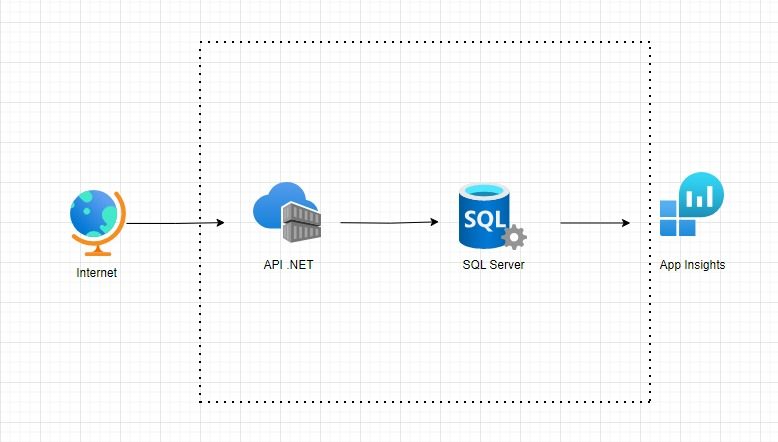

# Diagram
---

## Architecture
---



## Techical Stack
---
- ASP.NET Core 6.0 (with .NET 7.0)
- ASP.NET WebApi Core
- ASP.NET Identity Core
- Entity Framework Core
- .NET Core Native DI
- MediatR
- Swagger UI
- SQL Azure
- xUnit
- Moq
- Fluent Assertions
- Fixture

## Design Patterns
---
- Domain Driven Design
- CQRS
- Unit Of Work
- Repository & Generic Repository
- Inversion of Control / Dependency injection
- ORM
- Mediator
- Specification Pattern
- Options Pattern


## How to run
---

- For Visual Studio: `Select profile > Run (F5)`
- For VSCode: `Select configuration > Run (F5)`
- For Terminal:
```PowerShell

dotnet build src\TC.GrupoTrinta.BlogNews.Api\TC.GrupoTrinta.BlogNews.Api.csproj
dotnet run --project src\TC.GrupoTrinta.BlogNews.Api\TC.GrupoTrinta.BlogNews.Api.csproj --launch-profile http
dotnet watch --project src\TC.GrupoTrinta.BlogNews.Api\TC.GrupoTrinta.BlogNews.Api.csproj run
```

### Testing
---
- Terminal: `dotnet test`

### Docker
---
```Docker

docker build -t blognews-docker-image .
docker run -it --rm -p 3000:80 --env ASPNETCORE_ENVIRONMENT=Development --name blopnews-docker-container blognews-docker-image
docker run -dp 3000:80 --env ASPNETCORE_ENVIRONMENT=Development --name blognews-docker-container blognews-docker-image
```


###  Docker Compose
---
```Docker

docker-compose -f docker-compose-integration.yml up
```

## Swagger (Dev env only)
---

- http://localhost:3000/swagger/index.html

## Swagger (Publish Azure - Web App Service)
---

- https://grupotrinta-fiap.azurewebsites.net/swagger/index.html


## Use the [Install-Module](https://learn.microsoft.com/pt-br/powershell/module/powershellget/install-module) cmdlet to install the PowerShell Az module:
---

```PowerShell

Install-Module -Name Az -Repository PSGallery -Force
```

Connect Azure Account 

```PowerShell

Connect-AzAccount
```

### Create image (Azure Container Registry - CLI)
---

```Azure

az acr build --image blognews:v1 --registry acrgrupotrinta --file Dockerfile .
```

### Create Container (Azure instance - CLI)

```Azure

az container create --name blognews --image acrgrupotrinta.azurecr.io/blognews:v1 --ip-address public -g grupotrinta-fiap -e ASPNETCORE_ENVIRONMENT=Development --ports 80 443
```